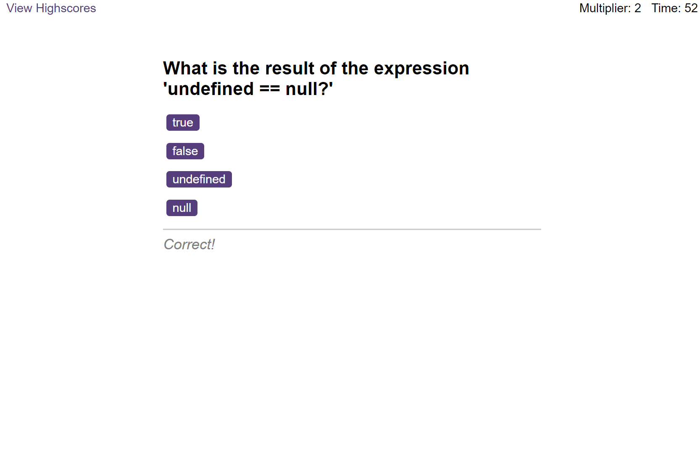

# Javascript fundamentals quiz

## Short description on the quiz/project

The objective of this project is to create a quiz on JavaScript fundamentals. The quiz itself will be multiple choice and can be used as fun little exercise for those learning to code that want to test their knowledge. Number of questions included at present is limited but could be expanded upon in future.

The quiz itself will be timed and work on a point base system. Overall score will be determined by (time left x multiplier score(increases from successive correct answers)). The scores will then be saved into local storage and presented in a leaderboard.

### User Story

```
AS a JavaScript student
I WANT to take a timed quiz on JavaScript fundamentals that stores high scores to local storage
SO THAT I can test my knowledge with a fun quiz
```

### Acceptance Criteria

My website must load and function as intended. The ways in which the quiz/website should work are:

- It should begin with a start button that when clicked a timer starts and the first question appears.

  - Questions contain buttons for each answer.

  - When an answer is clicked, the next question appears

  - A feedback prompt should display upon each answered question

  - Depending on a correct/incorrect answer time will either be added/subtracted from the timer

- The quiz should end when 10 questions are answered correctly or the timer reaches 0

  - If the timer reaches 0 the user will be given the option to restart quiz

  - When the game ends, it should display their total score and give the user the ability to save their initials and their score

  - They will then be taken to the Highscores and their data will be displayed in the leaderboard (data from local storage)

  ### Screenshot of completed site

The following image shows the web application's appearance



### License

Please refer to license in the Repo

### Website Link

https://britishcryptoguy.github.io/Bootcamp-Challenge-2-Portfolio/
